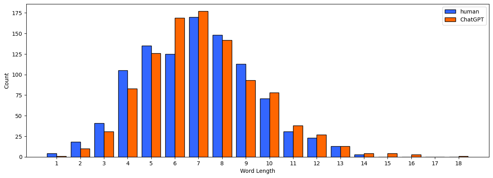
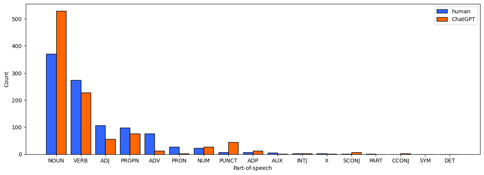
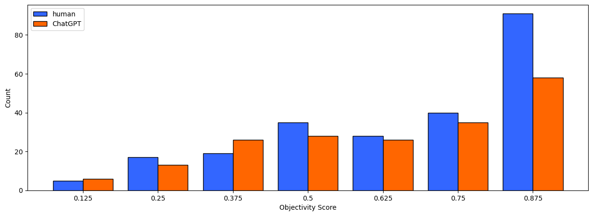

# Experiment and Analysis

## Data

The dataset used for model training and analysis is HC3-English, which consists of nearly 25,000 questions, nearly 60,000 human responses and 27,000 ChatGPT responses. The Q\&A data comes from wiki, Medical Dialog, and other fields. The dataset was divided into training set, verification set and test set according to the ratio of 7:1:2. In the evaluation and analysis part, 500 texts from both humans and ChatGPT respectively in the test set will be applied on our model to generate statistical results.

## Evaluation Method

The evaluation will be conducted from three word-level features: word length, part-of-speech, and sentiment. By comparing the statistical results of these three features applied on our method with conclusions of existing researches, we can check the correctness of our method.

## Experimental Details

For each of the 500 pieces of text generated by humans and ChatGPT, each text was predicted by the model and the words contribution was calculated. Additionally, for a certain piece of text, words with contribution score greater than 0.75 were defined as "decision important" words and were extracted and used in statistical process.

To avoid the bias caused by frequent words like "the", we de-weighted all words and used the average contribution of the repeated "decision important" words to indicate its contribution. After that, we got 1023/1179 "decision important" words for humans/ChatGPT. For comparison, the top 1000 contribution of words for humans/ChatGPT were kept for further analysis.

## Results

## Analysis

### Average Word Length

Some researches revealed that humans tend to use shorter words to express the same meaning (e.g., using *math* rather than *mathematics*). Relatively, ChatGPT has no such tendency. As shown in Figure 1, among words of 1-5 length, the number of high-contribution words for prediction "human" is higher than that for ChatGPT. And for longer words, prediction "ChatGPT" is the majority. So, our method behaves well in this property.

### Part-of-speech
According to Biyang Guo's research, ChatGPT tend to use less adverbs and punctuation but more other part-of-speech compared by humans, which shows the argumentation, informativeness and objectivity. As shown in Figure 2, the number of high-contribution nouns for prediction "ChatGPT" is nearly fifty percent higher than that of human. And much more adverbs were extracted for prediction "human". It indicates that the language model takes advantage of argument information to make the prediction of ChatGPT generated text.

However, the opposite results of verbs, adjectives, and punctuation show the weakness of our method. This may be led by the focus only on the word scale but ignoring the sentence structure.

### Sentiment
Here we use the sentiment dictionary of WordNet, which provides a way to quantify the objectivity of a certain word by positive and negative scores. From Figure 3, we can see that most objectivity scores of less than 1.0 come from prediction "humans" and more objective words for prediction "ChatGPT". It suggests that words generated by ChatGPT have strong objectivity and that humans tend to use some emotional words. However, this distinction is not so obvious, whose reason may be that sentence structure is not taken into account in the sentiment labeling process.

<!-- 
## Experiment Design

The main experiment is to evaluate the word contribution method and extract common rules from that. 500 texts from both human and ChatGPT respectively in "test.json" were used as the experimental dataset. Each text was predicted by the model and the words contribution (details in milestone 1) were calculated. Additionally, words with contributions greater than 0.75 were defined as "decision important" words and were used in statistical experiments.

In this study, only features in word-level were experimented and analyzed. It means that only word-level information in RoBERTa model was focussed in this experiment.

The experiment will be conducted from three word-level features: word length, part-of-speech, and sentiment. By analyzing these 3 features, the different attention to words in the classification process of the baseline model will be revealed, which will help to further improve the performance of the model. 

## Results

Here, only part of experimental results that need further improvement are shown below:

Fig 1. Word length

Fig 2. Part-of-speech

Fig 2. Sentiment
 -->