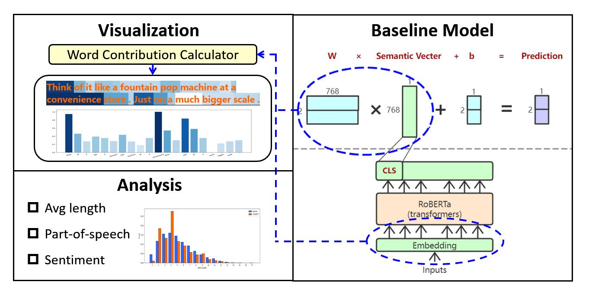

# Word-Level Interpretation of ChatGPT Detector Based on Classification Contribution

SLP Course Final Project - Dekun Chen - 120090336

This is a copy version from the original one, since the regulation of the SLP course.

## Abstract

ChatGPT detector is considered as a necessary task to regulate the use of ChatGPT. And the difficulty in interpreting the detecting process and results is a common problem of LLM. Most of the existing interpreters concentrated on attention visualization but took little account of classification process. In this work, we propose a method to display word contribution to the model prediction. Specifically, the information from classification weight vectors, semantic vector, and embedded input word vector is considered in our work for a more comprehensive explanation of detector LLM. Three word-level properties (word length, part of speech, word semantic) are used to validate our method by comparing with conclusions of existing works.

## Introduction

ChatGPT has gained significant attention in recent years, leading to a surge in research on this topic. Although ChatGPT can help make decisions, it is more significant to clarify the responsibility, especially in health care and finance. ChatGPT detector, built for verifying whether AI or humans generate the text, was regarded as one of the essential tasks. So far, many different detectors have been developed with very high prediction accuracy on different data sets. However, most detectors are black boxes for users, and only assertion is usually insufficient. Therefore, the visualized result of interpretation is of great importance. It would help both detector users and experts to better understand the captured features and judgement reasons of the detector model. In this work, we focus on the contribution of words to the results of the detector classification process.

Since most detectors were transformer-based models, many researches concentrated on attention visualization. Bertviz, a multi-scale attention visualization tool, could be used to explore the degree of the model's attention to tokens. Moreover, the more powerful $T^3$-Vis could help experts more comprehensively analyze transformer-based model. However, they only showed transformer in detail and did not take the classification process into account. So that it was difficult to display the focus on the two categories. In addition, there were other detection approaches based on statistics. GLTR was a visual tool that helped humans detect generated text. But it was less effective than the large language models predicted.

To solve the above issues, we propose a visual tool to interpret the classification process by word-level contribution. As shown in the figure, weight vectors from the classification process were considered, together with the output semantic vector. By calculating the similarity with input embedding vectors, the word contribution to classification could be visualized. In our model, we take advantage of the information from both transformer and classification process. So that it has a more accurate interpretation of the integrated language model.

## Approach and Experiment

If you are interested in the baseline model, it is available [here](Baseline_Model).

If you are interested in the visualization approach, it is available [here](Visualization).

If you are interested in the experiment and analysis part, it is available [here](Analysis).

<!-- To help develop a deeper understanding of RoBERTa-based detector model, a series of visualization methods will be built for clear interpretation.

In general, the research will include two stages: Visualization display by excavating the attention mechanism under the current model; Word-level analysis and improvement suggestions based on visualized results. The dataset is from [HC3-English]((https://huggingface.co/datasets/Hello-SimpleAI/HC3/tree/main)), which contains questions with answers from ChatGPT and humans.

The baseline is from the fine-tuned RoBERTa classification model and the hidden word-level information will be extracted to generate visualization results. In detail, the visualization part will include two submissions: Display the classification contributions of different words by semantic vector; Visualize the attention mechanism within roBERTa model. The overall architecture is shown below. After that, the existing word-level rules of differences of generated text between humans and ChatGPT were used to validate the word contribution visualization method. And reversely, some other rules could be summarized and verified. Then, together with the attention visualization, some suggestions to improve the baseline model would be made.

For detail, the visualization part can be viewed by [Visualization](Visualization). And the analysis part van be viewed by [Analysis](Analysis). -->

<!-- Based on the baseline model, there are two visualization methods. The first one displays the input words by different shades (for contribution) and color schemes (for prediction of humans or ChatGPT) of background. The second one uses BertViz tools \cite{bertviz} to visualize attention process and highlights the tokens that the model focussed. The analysis and suggestion part will be further improved by existing visualization results in the future.

## Milestone of Stage 1
So far, the visualization part has been almost completed, which contains two different methods. The detailed approaches can be found in [directory](Visualization). The most challenging part is the analysis of visualization results, which requires the deep view of attention mechanism and more linguistic knowledge between ChatGPT and humans. It needs to be supported by more in-depth papers in different fields. -->
