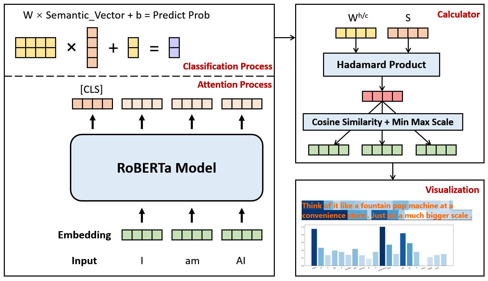
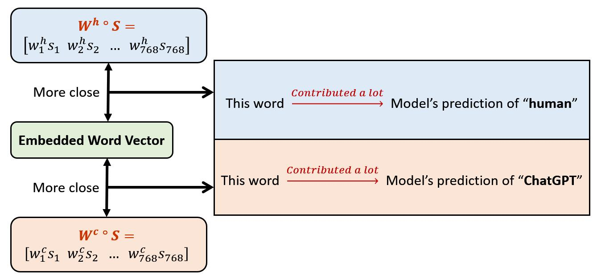
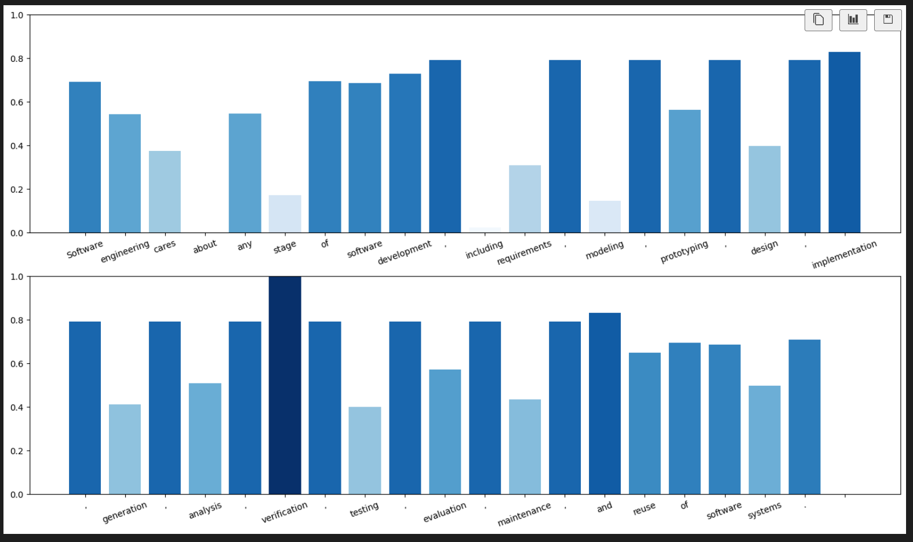
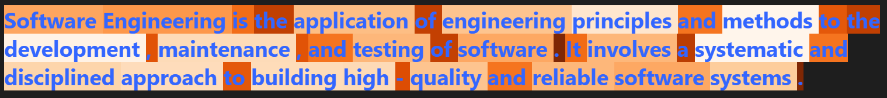
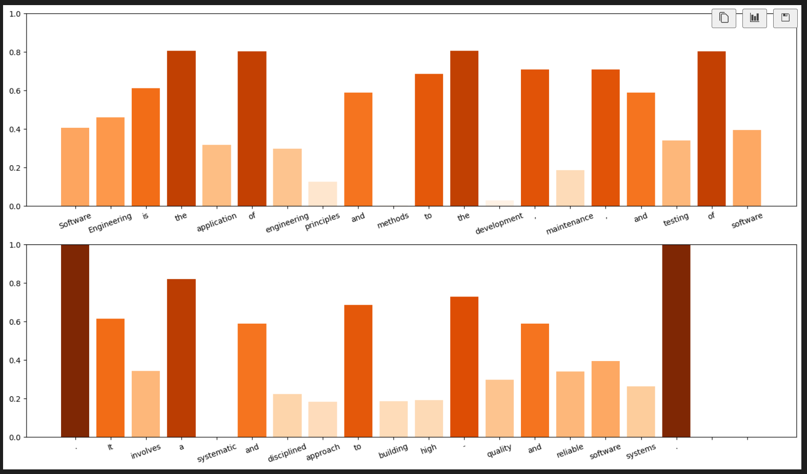

# Visualization

## Introduction

As shown in the above figure, our work consists of two parts. The baseline model produces the probabilities of humans/ChatGPT for the input. And the word contribution calculator takes advantage of information from the baseline model to calculate the contribution scores of classification for each input word.

## Main Process

From the fully connected layer classifier, we obtain the semantic vector and weight vectors, representing by: (768 is the default dimension of embedding. And $w^{h}$ for humans and $w^{c}$ for ChatGPT)

$$
   S = \begin{bmatrix}
   s_{1} & s_{2} & \dots & s_{768} \\
   \end{bmatrix}
$$

$$
   W = \begin{bmatrix}
   w_{1}^{h} & w_{2}^{h} & \dots & w_{768}^{h} \\
   w_{1}^{c} & w_{2}^{c} & \dots & w_{768}^{c}
   \end{bmatrix}
$$

Take the Hadamard product of $S$ with respect to $W^{h}$ and $W^{c}$ to get classification weighted vectors for humans and ChatGPT. Details can be found in the following figure. 

In the condition of the prediction "human", the closer the embedded input word vector and $W^h \circ S$ are, the higher the contribution of this word in the process of the prediction "human". Conversely, if the prediction is "ChatGPT", the closer the embedded input word vector and $W^c \circ S$ are, the higher the contribution of this word in the process of the prediction "ChatGPT".

Therefore, cosine similarity is calculated for each embedded vector and the classification weighted vector of the corresponding label to represent the classification contribution of each word: (Assume the embedded vector of i-th word is $A_i$.)

## Examples
There are two answers to the question "What is software engineering?". The first answer is from SPLASH OOPSLA 2022 (humans):

_Software engineering cares about any stage of software development, including requirements, modeling, prototyping, design, implementation, generation, analysis, verification, testing, evaluation, maintenance, and reuse of software systems._

The second one is from ChatGPT3:

_Software Engineering is the application of engineering principles and methods to the development, maintenance, and testing of software. It involves a systematic and disciplined approach to building high-quality and reliable software systems._

For humans' answer, here is the visualization result:

And here is the result of ChatGPT:

The predicted label will determine the color style (Blues for human prediction, Oranges for ChatGPT prediction). And the more shaded the color is, the more classification weights the word contributes. Additionally, the detailed contribution scores can be checked on the bar chart.
